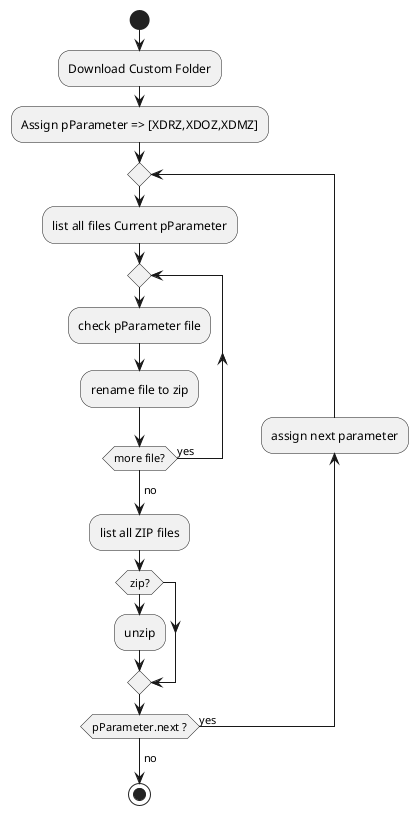

```plantuml
@startuml
start
:Download Custom Folder;
:Assign pParameter => [XDRZ,XDOZ,XDMZ];
repeat
:list all files Current pParameter;
repeat
:check pParameter file;
:rename file to zip;
repeat while (more file?) is (yes)
->no;
:list all ZIP files;
if (zip?) then
:unzip;
endif
backward:assign next parameter;
repeat while (pParameter.next ?) is (yes)
->no;
stop
@enduml
```